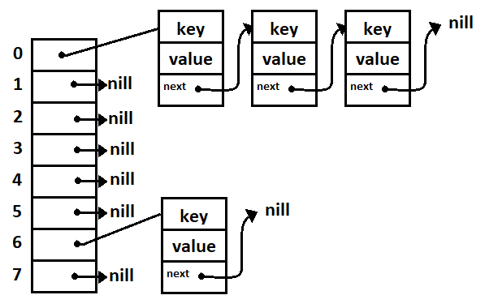

# Esercizio3
---
## Prefazione
L'esercizio ha come obiettivo principale quello di dimostrare la differenza tra una struttura dati di tipo HashMap da un semplice Array.
la dimostrazione viene effettuata in pratica dai tempi di caricamento/esecuzione.

### Implementazione HashMap

La struttura della Hash Map è stata realizzata tramite un array di puntatori, i quali puntano ad una lista di nodi contenenti le associazioni di tipo <Key, Value>; non vi può essere la presenza di chiavi ripetute in quanto la funzione Insert non ne permette l'inserimento.

### Tempi
Dopo l'implementazione di tutte le funzioni necessarie allo svolgimento dell'esercizio, sono stati misurati i seguenti tempi:
- Caricamento del contenuto del file "hashes.txt" nella struttura Hash Map: **7.51800 sec**
- Caricamento del contenuto del file "hashes.txt" in un array e ordinato per chiave con l'utilizzo del quickSort: **12.74000 sec**
- Tempo necessario al recupero dalla Hash Map di valori random: **0.88100 sec**
- Tempo necessario al recupero dei valori random dal array tramite ricerca binaria: **5.86400 sec**
- Numero di chiavi nella hashmap: **6383242**
- Numero di chiavi nell'array: **6383242**
