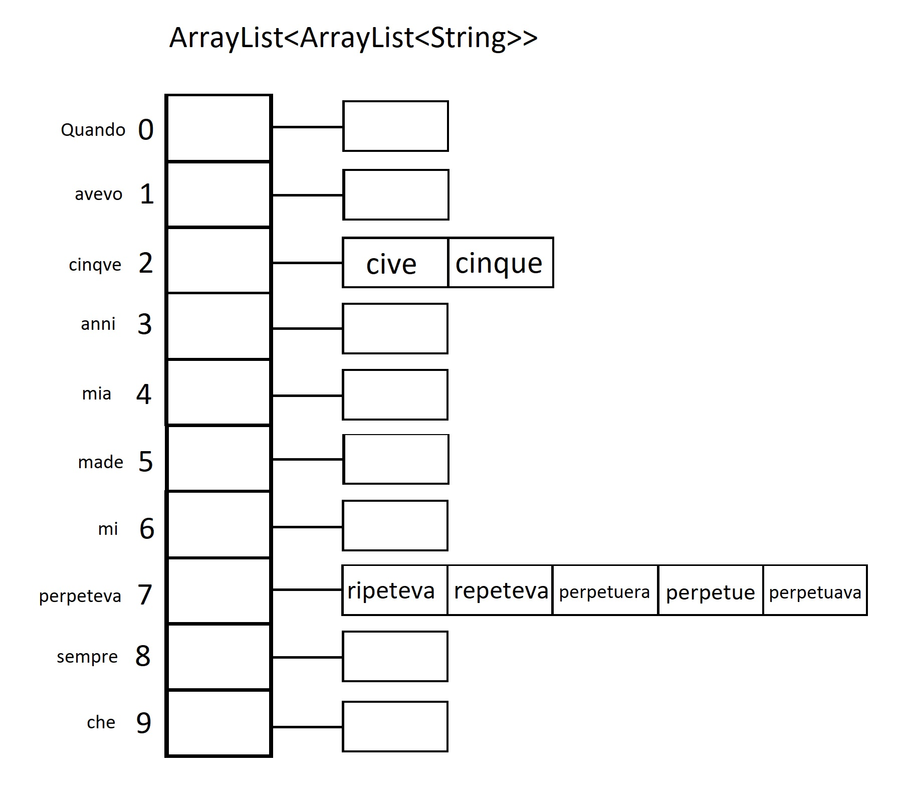

# Esercizio2
---
## Prefazione

L'esercizio ha come obiettivo principale quello di correggere gli errori grammaticali contenuti all'interno di un file `correctme.txt` il quale contiene una citazione di John Lennon.
Per fare ciò il programma utilizza un ulteriore file `dictionary.txt` il quale funge da dizionario della lingua italiana.

## Implementazione
Inizialmente i due file di testo vengono rispettivamente caricati all'interno di ArrayList, i quali ci permetteranno di svolgere i confronti tra le parole della citazione ed il dizionario.

Fondamentale è l'utilizzo della funzione "EditDistanceDyn" la quale ha come obiettivo principale quello di restituire il numero minimo di editDistance, il quale ci è utile per proporre quali parole siano più "simili" alla parola errata data.

Nel caso in cui la parola sia corretta dal punto di vista grammaticale, quindi l'editDistance è pari a 0 e viene trovata all'interno del dizionario, non verranno restituite proposte.
Da implementazione dell'EditDistance potrebbe capitare che alcune parole errate restituiscano un editDistance minore con alcuni termini che non sono quelli attesi ma corretti secondo il dizionario.

Al termine del confronto di ogni vocabolo del dizionario associato ad una parola della citazione salviamo i vocaboli con edit distance minimo all'interno di un ArrayList. Così facedo si ha un ArrayList di ArrayList dove gli indici della prima struttura corrispondono alle parole della citazione e associato ad ogni suo indice è presente il secondo Arraylist contenente i vocaboli del dizionario con EditDistance minimo.

## Conclusione
A seguito dei test svolti risulta che i tempi di esecuzione sono pari a 15 secondi con un totale di 7 parole corrette e 2 parole errate non corrette a causa della presenza nel dizionario del termine con significato diverso.
La complessità temporale dell'EditDistance nel caso peggiore non dinamico è:
$O(3^m) \\ m = string1Length$
La complessità temporale dell'EditDistance con la programmazione dinamica è:
$O(m*n) \\ m = string1Length\\  n = string2Length$
